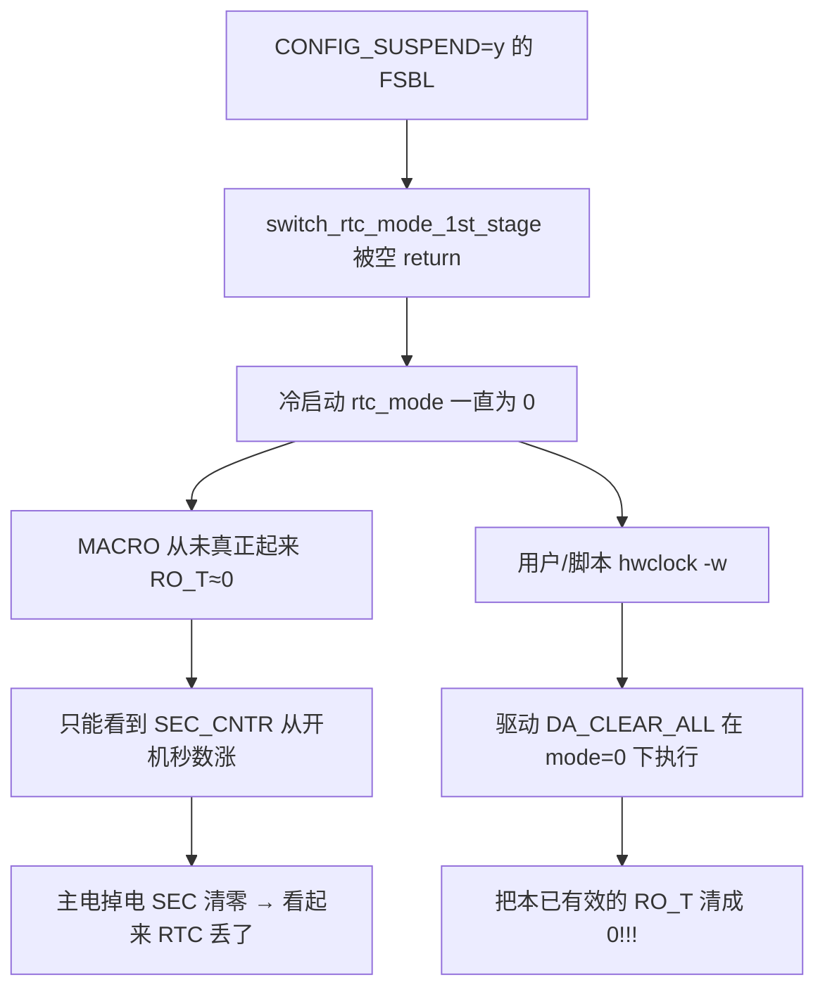

# SG2000 / CV181x RTC MACRO + VBAT 保时踩坑记录

> 板型：zonhor SG2000（CV181x）  
> 时间：2026-07  
> 现象：主电源断电再上电后系统时间回到 1970 / RTC 秒计数很小；示波器确认 VBAT_DET、PWR_RSTN 等全程保持高电平（独立电池在）。  
> 结论：**硬件电池正常，软件未正确启用 / 保护模拟 MACRO 秒计数器。**

相关代码与本文档交叉引用，改 RTC / FSBL / `hwclock` 前请先读完。

---

## 1. 两个「自增」寄存器分别是什么

基址：`RTC_BASE = 0x05026000`（DTS `rtc` 第一个 `reg`）。

| 名称 | 物理地址 | 偏移 | 域 | 断电（只断主电、VBAT 在） |
|------|----------|------|----|---------------------------|
| `SEC_CNTR_VALUE` | **`0x05026018`** | `+0x18` | 数字域 | **会清零 / 从 0 附近重计** |
| `RO_T`（MACRO） | **`0x050264A8`** | `+0x4A8` | 模拟 MACRO / 常电 | **应继续走秒（Unix epoch）** |

二者存的都是 **Unix 秒**（自 1970-01-01 00:00:00 **UTC** 起的秒数），不是拆开的时分秒字段。

```sh
# 观察自增（约 1Hz）
devmem 0x050264A8 32; sleep 1; devmem 0x050264A8 32
devmem 0x05026018 32; sleep 1; devmem 0x05026018 32

# 换算成人可读（UTC）；板子 TZ=Asia/Shanghai 时本地 = UTC+8
python3 -c 'import datetime; print(datetime.datetime.utcfromtimestamp(0x6A64C256))'
```

写时间相关：

| 寄存器 | 地址 | 作用 |
|--------|------|------|
| `SET_SEC_CNTR_VALUE` / `TRIG` | `0x05026010` / `0x14` | 写数字域秒 |
| `RG_SET_T` | `0x05026498` | 写 MACRO 秒 |
| `DA_CLEAR_ALL` | `0x05026480` | MACRO 握手（**危险**，见下） |
| `DA_SOC_READY` | `0x0502648C` | MACRO / mode 切换脉冲 |

控制：

| 寄存器 | 地址 | 关键位 |
|--------|------|--------|
| `RTC_CTRL0` | **`0x05025008`** | **bit10 `rtc_mode`**，bit11 `clk32k_cg_en` |
| unlock | `0x05025004` | 写 `0xAB18` 后再改 `CTRL0` |
| `STATUS0` | `0x0502500C` | bit25 `cg_en_out_clk_32k` |

**勿与 MCU 邮箱混淆：** `RTC_INFO0..3`（`0x0502601C` 起）是 Linux↔8051 软件邮箱；`INFO2` 的 `run_ms` 是 MCU 软件累加，不是硬件秒 RTC。

---

## 2. 根因链（为什么「有电池还丢时间」）



### 2.1 FSBL 在 `CONFIG_SUSPEND` 下跳过 mode 切换

原代码（**已删除，切勿加回**）：

```c
#ifdef CONFIG_SUSPEND
	return;   /* 冷启动也跳过 → rtc_mode 永不为 1 */
#endif
```

zonhor defconfig：`CONFIG_SUSPEND=y` / `SUSPEND=y` → FSBL 带上该宏。  
旁证：板上 `RTC_POR_RST_CTRL (0x050250AC) = 0x2` 也是 SUSPEND 路径写入。

`switch_rtc_mode_1st_stage()` 才是把 **`rtc_mode[10]=1`** 并脉冲 `DA_SOC_READY` 的地方；不做则 MACRO 写不进去。

### 2.2 `rtc_mode=0` 时 `hwclock -w` 会毁掉 RO_T

实测：

1. `rtc_mode=1` 且 `RO_T` 正常自增  
2. 清 `rtc_mode` 为 0 后，`RO_T` 仍可读、仍自增  
3. **在 mode=0 下走一遍 set_time（含 `DA_CLEAR_ALL`）→ `RO_T` 立刻变 `0`，且不可自行恢复**

因此：**在未确认 `RTC_CTRL0` bit10=1 之前，禁止 `hwclock -w` / 禁止 MACRO 握手写。**

`date` / `ntpdate` 只改 Linux 系统时钟，**不会**写入硬件 RTC；必须通过 `/dev/rtc0`（`hwclock -w`）且 mode 正确。

### 2.3 与 MCU51 **无关**

`mcu51-up` 只动 `RTCSYS_RST` bit1（8051 复位）和 SRAM / `RTC_INFO*`。  
实测 hold/release MCU 后：`rtc_mode` 与 `RO_T` 均不受影响。

### 2.4 2nd stage 清 mode 的坑

原 `switch_rtc_mode_2nd_stage()` 在 QFN / 无外部 32k 时序路径上会 **清掉 `rtc_mode[10]`**，抵消 1st stage。  
已改为内部 32k 路径也 **保持 bit10=1**。

---

## 3. 已做修复（源码位置）

| 层级 | 文件 | 要点 |
|------|------|------|
| FSBL | `fsbl/plat/cv181x/platform.c` | 去掉 SUSPEND 空返回；2nd stage 保持 `rtc_mode` |
| 驱动 | `osdrv/interdrv/rtc/cv181x/cvi_rtc.c` | `cvi_rtc_ensure_macro_mode()`；set_time 前确保 mode；mode=0 跳过 MACRO 写；probe 从 `RO_T` 恢复 `SEC_CNTR` |
| 启动脚本 | `device/zonhor-*/overlay/etc/init.d/S02hwclock` | 启停前 ensure mode；mode=0 禁止 `-w` |

成功上电日志特征：

```text
cvi_rtc ...: Disable calibration because rtc_mode/MACRO enabled
cvi_rtc ...: restored SEC_CNTR from MACRO RO_T=<unix_sec>
cvi_rtc ...: setting system clock to 2026-...
```

断电保时验证示例（主电断约 8 分钟，VBAT 保持）：

- 断电前 `RO_T ≈ 0x6A64C067`  
- 上电后 `RO_T ≈ 0x6A64C256`（差值约 495s）  
- dmesg 从 MACRO 恢复系统时钟 → **链路打通**

---

## 4. 运维检查清单

```sh
# 1) rtc_mode 必须为 1（CTRL0 常见约 0x00000C40）
devmem 0x05025008 32
# bit10 = ((val>>10)&1)

# 2) RO_T / SEC 应为接近的大 Unix 秒，且每秒 +1
devmem 0x050264A8 32
devmem 0x05026018 32

# 3) 系统时间
date; hwclock -r -f /dev/rtc0

# 4) 仅在 mode=1 时写回硬件
hwclock -w -f /dev/rtc0
```

手动补做 FSBL 1st stage（仅调试；正常应由 FSBL/驱动/S02 完成）：

```sh
# 详见 S02hwclock 中 ensure_rtc_macro()，或驱动 cvi_rtc_ensure_macro_mode()
```

刷机注意：

- **改 FSBL 后需重编并烧录 fip/FSBL**，否则冷启动仍可能 mode=0（依赖驱动/S02 兜底）。  
- 新 `cv181x_rtc.ko` 需随 rootfs/`/mnt/system/ko` 更新；`bad vermagic` 仅为 out-of-tree 提示。

---

## 5. 以后绝对不要做的事

1. **不要**在 `switch_rtc_mode_1st_stage()` 里加回 `#ifdef CONFIG_SUSPEND return;`  
2. **不要**在 `rtc_mode=0` 时执行 `hwclock -w` 或驱动 MACRO `DA_CLEAR_ALL` 路径  
3. **不要**以为「`date` 对了 = RTC 电池保时 OK」——要看 `0x050264A8`  
4. **不要**把 `RTC_INFO2` 当成硬件 RTC 秒计数  
5. **不要**把 MCU51 复位当成 RTC 时间丢失的首要嫌疑（先查 `rtc_mode` / `RO_T`）  
6. **不要**在 2nd stage 为「内部 32k」再次清掉 `rtc_mode[10]`

---

## 6. 快速对照：正常 vs 异常

| 项目 | 异常（踩坑时） | 正常（修好后） |
|------|----------------|----------------|
| `0x05025008` bit10 | 0（如 `0x840`） | 1（如 `0xC40`） |
| `0x050264A8` | 恒 `0` 或被 `-w` 清零 | 大 Unix 秒，1Hz +1 |
| `0x05026018` | 开机后一百多秒量级 | 与 `RO_T` 接近 |
| 主电掉电再上电 | 时间回 1970 | dmesg `restored ... RO_T=`，时间连续 |
| dmesg | `RTC invalid time` / calib completed | `MACRO enabled` + restore |

---

## 7. 参考路径速查

```
fsbl/plat/cv181x/platform.c          # switch_rtc_mode_1st/2nd_stage
osdrv/interdrv/rtc/cv181x/cvi_rtc.c  # ensure_macro_mode / set_time / probe restore
device/zonhor-sg2000-glibc-arm64-emmc/overlay/etc/init.d/S02hwclock
device/zonhor-sg2000-glibc-arm64-nand/overlay/etc/init.d/S02hwclock
u-boot .../cv181x_reg.h              # RTC_MACRO_BASE = 0x05026400
```

文档维护：若再改 RTC 上电时序或 SUSPEND 策略，请同步更新本文「根因 / 不要做」两节。
