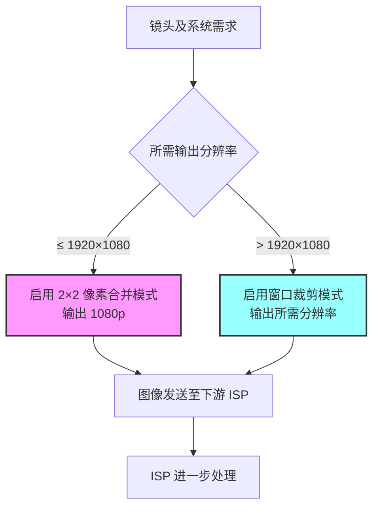

# 概述  
索尼 IMX678 是一款 1/1.8″ 约 8.4MP（推荐 3840×2160）分辨率的 CMOS 图像传感器。官方文档和应用说明指出，IMX678 支持**全像素扫描模式**（3840×2160 近似 8.29M）以及**水平/垂直 2×2 像素合并（binning）模式**（输出 1920×1080），并提供“窗口裁剪模式”用于任意分辨率的区域输出。传感器本身不具备其它子采样或任意比例缩放功能，因此**非裁剪式的降分辨率**主要由 2×2 合并来实现。支持的输出模式和分辨率如下：

- **全像素模式（All-pixel scan）**：输出接近原始像素数（有效 3840×2160，约 8.29M）。最高帧率可达 72fps（10-bit）/60fps（12-bit）。此模式视场最大，但需要最大的传输带宽和处理能力。  
- **2×2 合并模式（Horizontal/Vertical 2/2-line binning）**：传感器在读出时将 2×2 区域内的像素融合为一个输出像素，输出分辨率固定为 1920×1080（约 2.07M）。由于像素融合，单帧灵敏度提高（低光下噪声改善），但分辨率降低。帧率上限与全像素模式相同（10-bit 72fps，12-bit 60fps）。该模式下视场（FOV）保持不变。  
- **窗口裁剪模式（Window cropping）**：可从全像素视场内任意位置截取任意宽高（宽度须为16的倍数、高度须为4的倍数）输出。裁剪后输出分辨率和视场按配置减少。此模式不进行像素融合，只截取部分有效区域。输出帧率上限因读出行数减少而略有提升，但文档未明确给出，一般视具体裁剪大小和 MIPI 通道配置而定。裁剪模式下视场缩小，噪声特性与全像素相同。  

各模式的配置（寄存器设置）和特性可参见索尼文档说明：IMX678 数据手册列出对应模式，软件参考手册（SRM）给出详细寄存器。简要而言：设置寄存器 `WINMODE` 可切换到裁剪模式（设置值 0x04h），并使用 `PIX_HST/PIX_HWIDTH`、`PIX_VST/PIX_VWIDTH` 指定水平/垂直裁剪的起始位置和宽度。合并模式通常为默认输出模式（`WINMODE=0`），无需额外配置（驱动中启用 binning 模式即可）。下表汇总了主要输出模式：  

| 模式名称          | 输出分辨率      | 像素合并/裁剪 | 最大帧率       | 配置/寄存器                          | 优缺点说明                           |
|:---------------:|:------------:|:------------:|:-------------:|:-----------------------------------:|:---------------------------------:|
| 全像素扫描模式     | 3840×2160 (≈8.29M)  | 无 (Full)     | 10-bit 72fps；12-bit 60fps | 默认模式（`WINMODE=0`），可全帧输出         | **优势**：最高分辨率、不失真全景；**劣势**：数据量大，对下游 ISP 带宽要求高，噪声相对略高。 |
| 2×2 像素合并 (Binning) | 1920×1080 (≈2.07M)  | 2×2 融合      | 10-bit 72fps；12-bit 60fps | 设定合并模式（相关寄存器由驱动/SDK 配置）    | **优势**：灵敏度高、噪声低（像素面积增大），输出带宽小；**劣势**：分辨率降低为原来的四分之一，仍需适配 ISP。 |
| 窗口裁剪模式       | 自定义，宽×高 (≤3840×2160) | 裁剪 (ROI)     | 视裁剪区域可略高于全像素模式      | 设置裁剪寄存器（`PIX_HST/PIX_HWIDTH`, `PIX_VST/PIX_VWIDTH`, `WINMODE=4`） | **优势**：灵活输出任意分辨率，可降低像素数；**劣势**：视场减小（局部视图）、裁剪边缘略增量化噪声。 |
| 垂直/水平翻转输出    | 同模式分辨率 (镜像) | 无             | 同模式         | 设置 `VREVERSE/HREVERSE` 寄存器（翻转输出方向） | 用于图像翻转；对分辨率和帧率无影响。              |

以上模式和参数总结自索尼官方资料。IMX678 无其他“跳帧”或任意比例降采样模式，故无法直接输出介于 3840×2160 与 1920×1080 之间的分辨率（如≈5MP）。如需约 5MP 输出，可在裁剪模式下设置合适宽高（例如裁剪到 3840×(约1380)，约5.3M），但此时视场显著缩小，需要注意。  

## 限制与兼容性建议  
- **帧率与带宽**：全像素模式下，建议使用更多 MIPI 通道（可支持至 8lane）以达到最高帧率。裁剪/合并后数据量减小，低通道配置下也能达到类似帧率。若下游 ISP 或硬件带宽不足，可切换到 2×2 合并模式以减小数据量（输出仅 1080p）。  
- **视场（FOV）变化**：2×2 合并不改变视场，但会损失细节。窗口裁剪显著改变视场，只保留图像中心或其它指定区域，常用于只需部分场景或模拟低分辨率感光场景时使用。  
- **噪声与灵敏度**：合并模式提高单像素灵敏度，低光下表现更好；裁剪模式输出像素与全像素相同，对噪声无改善。  
- **ISP 兼容**：若下游 ISP 无法处理 8MP 原始数据，推荐使用 2×2 合并直接输出 1080p。注意某些软件栈（如 NVIDIA Libargus 等）可能默认将合并输出视为普通 RAW，可能需要在 ISP 或驱动中对亮度进行校正以恢复合并带来的增益（参考相关开发者论坛讨论）。  
- **实用对策**：使用传感器支持的方式进行分辨率转换，尽量避免后级 ISP 强制缩放，以保留最佳图像质量。如需要非 1080p 的中间分辨率，可通过窗口裁剪然后在软件中缩放，或使用额外硬件缩放器。  

## 推荐实施步骤与验证  
1. **模式切换配置**：根据需求在驱动或寄存器中选择相应模式。开启 2×2 合并模式时，无需额外裁剪寄存器设置。使用裁剪模式时，应写入 `WINMODE=4`，并设置裁剪起始 (`PIX_HST`,`PIX_VST`) 和尺寸 (`PIX_HWIDTH`,`PIX_VWIDTH`)（宽度为16的倍数，高度为4的倍数）。所有寄存器设置后应等待至少一帧以稳定输出。  
2. **帧率与带宽测试**：在不同模式下测量实际帧率。确保 CSI-2 通道数和时钟频率设置足够。例如，全像素 12bit 模式下，4 lane 下约可达 60fps ；在 2×2 合并（同 12bit）亦可达相同帧率。如帧率过低，可考虑降低分辨率或增加通道。  
3. **图像质量验证**：捕捉并对比各模式下的测试图。验证 2×2 合并模式下的亮度提升和噪声降低；验证裁剪模式下输出尺寸与预期一致，并观察视场变化。使用校准靶或光学边界图可检查输出是否有畸变。  
4. **ISP 兼容性测试**：将传感器输出连接到目标 ISP/处理器，测试其能否正确解码各模式图像。特别注意 10/12 位原始数据的位深处理，确保驱动或固件对合并模式的动态范围有适当处理（可能需要线性插值或增益调整）。如发现亮度偏暗，可在后处理阶段人为放大合并输出的 RAW 值。  



**总结**：IMX678 在硬件级别支持真正的 2×2 像素合并（无裁剪缩放）来实现 3840×2160→1920×1080 的降分辨率。其它期望的中间分辨率只能通过窗口裁剪或外部缩放实现。实施时应综合考虑帧率、带宽、视场和噪声影响，并确保下游 ISP/驱动正确处理合并输出的 RAW 数据。如有额外需求（例如特定分辨率或 FOV 保留），可结合裁剪模式和软件缩放等方法，最终通过实验验证输出效果。  

**参考资料**：索尼 IMX678 数据手册与规格说明。

---

## SG2000 Zonhor SDK 落地（本仓库）

本仓库在 `cvi_mpi/.../sony_imx678` 中同时支持两种 1080p 路径（**并存**）：

| 配置文件 | sensor name | 实现 |
|----------|-------------|------|
| `sensor_cfg.ini.imx678_1080p` | `SONY_IMX678_MIPI_2M_30FPS_12BIT` | 中心 PIX **裁剪**（FOV 缩小，MIPI 仍 3856×2180 RAW12） |
| `sensor_cfg.ini.imx678_1080p_bin` | `SONY_IMX678_MIPI_2M_30FPS_10BIT_BIN` | 硬件 **2×2 融合**（全 FOV，期望 MIPI ~1920×1080 RAW10） |
| `sensor_cfg.ini.imx678_5m` | `SONY_IMX678_MIPI_8M_30FPS_12BIT` | 中心裁剪 2880×1620（SG2000 5MP 上限） |

### 融合模式寄存器要点

- `ADDMODE(0x301B)=1`，`WINMODE(0x3018)=4`
- PIX 窗口 = **3840×2160** @ (8,8)（融合前感光区；输出宽高各为 1/2）
- `ADBIT/MDBIT=0` → 10-bit；ISP `raw_data_type = RAW_DATA_10BIT`
- 实现参考 Linux 上游 `imx678_program_window()`，**不是**历史 RK 720p 注释表

### 启用与验证

```bash
cp /mnt/system/usr/bin/sensor_cfg.ini.imx678_1080p_bin /mnt/data/sensor_cfg.ini
# 期望 Init: ===IMX678 1080P30fps 10bit LINE(bin) Init OK!=== ADDMODE=0x1 ...
# 期望 mipi-rx 帧尺寸约 1920x1080（非 3856x2180）
python3 zonhor-imx678-debug-collect.py
```

细节与踩坑见 `cvi_mpi/component/isp/sensor/sg200x/sony_imx678/PORTING_NOTES_SG2000.md` §7。

**颜色偏红蓝 / 三行一起错**：见 [IMX678_BAYER_RGGB_color_fix.md](./IMX678_BAYER_RGGB_color_fix.md)（ISP Bayer RGGB 配错，勿用 B-G-R workaround 掩盖）。

**CviIspTool `vi init failed` 专项排障**（配置 + 符号抢占 + 部署）：见 [CviIspTool_IMX678_BIN_troubleshooting.md](./CviIspTool_IMX678_BIN_troubleshooting.md)。